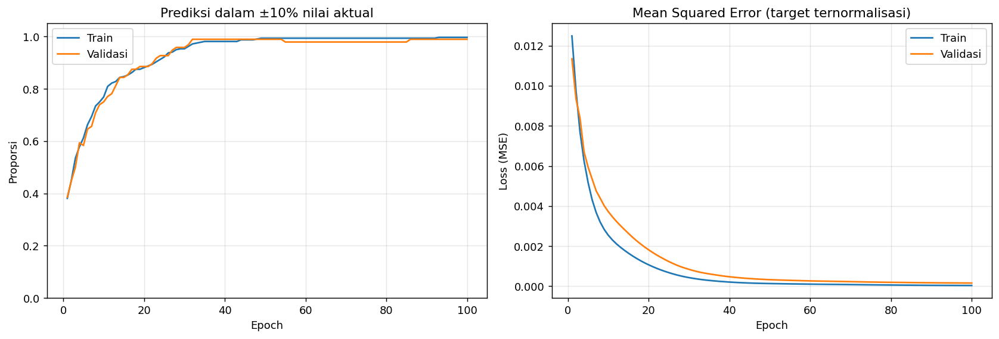

# Car Purchase Amount Prediction with ANN

An educational machine learning project that predicts car purchase amounts using a small artificial neural network built with TensorFlow/Keras.

**Author:** Tegar Reski Pratama · Informatika, Universitas Muhammadiyah Malang  
**Origin:** Adapted from CODELAB Modul 1 — Artificial Neural Networks.

## Project overview

This project demonstrates a regression workflow: inspect tabular data, select numeric features, split the dataset, scale inputs and the target, train an ANN, and evaluate predictions in the target's original units.

| Component | Configuration |
| --- | --- |
| Dataset size in saved output | 500 rows, 9 original columns |
| Inputs | Age, annual salary, credit card debt, net worth |
| Target | Car purchase amount |
| Test split | 20% (100 records), random_state=0 |
| Remaining data | 400 records; 20% reserved by Keras for validation |
| Preprocessing | Separate MinMaxScaler for features and target |
| Architecture | 4 inputs → Dense(10, ReLU) → Dense(10, ReLU) → Dense(1, linear) |
| Trainable parameters | 171 |
| Training | Adam, MSE, 100 epochs; Keras default batch size |
| Random seed | 0 |

## Recorded results

These values come from outputs already stored in the supplied notebook. **Training was not rerun during portfolio preparation** because the CSV was not supplied. Source execution counters are unset; these results have not been independently reproduced.

| Test metric | Saved value |
| --- | ---: |
| MAE, original target units | 316.87 |
| RMSE, original target units | 458.09 |
| R² | 0.9983 |
| Predictions within ±10% of the actual amount | 99.00% |
| MSE, normalized target | 0.000042 |

The tolerance metric is not classification accuracy. The currency of the target is not established in this package.



## Skills demonstrated

- Tabular data inspection using pandas and NumPy.
- Separate feature and target normalization with scikit-learn.
- ANN regression using TensorFlow/Keras.
- Inverse transformation for interpretable MAE and RMSE.
- Evaluation using R² and a defined prediction tolerance.
- Training visualization using Matplotlib.

## Run locally

1. Extract or clone this project, then open a terminal in its root folder.
2. Create a Python environment:

   ```bash
   python -m venv .venv
   ```

3. Activate it in Windows PowerShell:

   ```powershell
   .\.venv\Scripts\Activate.ps1
   ```

   Or on macOS/Linux:

   ```bash
   source .venv/bin/activate
   ```

4. Install dependencies:

   ```bash
   python -m pip install -r requirements.txt
   ```

5. Place `MODULE 1_CODELAB.csv` in this folder. See [dataset instructions](DATASET.md).
6. Launch Jupyter:

   ```bash
   jupyter notebook car_purchase_prediction.ipynb
   ```

7. Run cells sequentially from the top. Training generates new outputs; values can differ across environments.

The source notebook records Python 3.12 and TensorFlow 2.21.0. The requirements list is a starting environment, not an exact lockfile: other package versions were not recorded, and installation was not tested during packaging.

For Google Colab, upload the notebook and run it from the first cell; the dataset-loading cell asks for the CSV if it is missing.

## Repository files

| File | Purpose |
| --- | --- |
| `car_purchase_prediction.ipynb` | Annotated notebook with saved model outputs |
| `requirements.txt` | Python dependencies |
| `assets/training_curves.png` | Existing training visualization |
| `DATASET.md` | Required dataset filename, schema, and provenance status |
| `.gitignore` | Excludes local environments, caches, and CSV data |
| `PANDUAN_GITHUB.md` | GitHub upload guide in Indonesian |

## Limitations and next steps

- The test set is excluded from scaler fitting. However, scalers are fitted on all 400 development records before Keras extracts validation data. A stricter experiment should split train/validation/test first and fit scalers only on the optimization subset.
- Results represent one saved split/run, without baseline comparisons, uncertainty estimates, or external validation.
- The dataset's original publisher, license, and realism have not been verified. This package does not redistribute the CSV.
- Useful extensions include linear regression and random forest baselines, residual analysis, repeated-seed evaluation, and exporting the model together with its scalers.

## Attribution

This portfolio presents coursework adapted from CODELAB Modul 1 — Artificial Neural Networks. It does not claim a novel ANN architecture or an independently collected dataset. The instructor/module author and original dataset citation should be added when their details are available. No license is assigned to third-party coursework or dataset material in this package.
